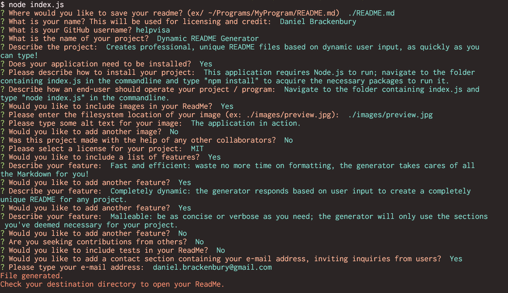

# Dynamic README Generator

## Description

Creates professional, unique README files based on dynamic user input, as quickly as you can type!

## Table of Contents
- [Installation](#installation)
- [Usage](#usage)
- [Images](#images)
- [Features](#features)
- [Credits](#credits)

- [Questions](#questions)
- [License](#license)

## Installation

This application requires Node.js to run; navigate to the folder containing index.js in the commandline and type "npm install" to acquire the necessary packages to run it.

## Usage

Navigate to the folder containing index.js and type "node index.js" in the commandline.

## Images

## Features

- Fast and efficient: waste no more time on formatting, the generator takes cares of all the Markdown for you!

- Completely dynamic: the generator responds based on user input to create a completely unique README for any project.

- Malleable: be as concise or verbose as you need; the generator will only use the sections you've deemed necessary for your project.

- Want to see it for yourself? You're already looking at it; this README was created using this very same generator!

## Credits

Created by [Daniel Brackenbury](https://github.com/helpvisa).

## Questions

Have questions regarding the project? Feel free to contact me at daniel.brackenbury@gmail.com or [here on GitHub](https://github.com/helpvisa).

## License

Copyright 2022 Daniel Brackenbury

Permission is hereby granted, free of charge, to any person obtaining a copy of this software and associated documentation files (the "Software"), to deal in the Software without restriction, including without limitation the rights to use, copy, modify, merge, publish, distribute, sublicense, and/or sell copies of the Software, and to permit persons to whom the Software is furnished to do so, subject to the following conditions:

The above copyright notice and this permission notice shall be included in all copies or substantial portions of the Software.

THE SOFTWARE IS PROVIDED "AS IS", WITHOUT WARRANTY OF ANY KIND, EXPRESS OR IMPLIED, INCLUDING BUT NOT LIMITED TO THE WARRANTIES OF MERCHANTABILITY, FITNESS FOR A PARTICULAR PURPOSE AND NONINFRINGEMENT. IN NO EVENT SHALL THE AUTHORS OR COPYRIGHT HOLDERS BE LIABLE FOR ANY CLAIM, DAMAGES OR OTHER LIABILITY, WHETHER IN AN ACTION OF CONTRACT, TORT OR OTHERWISE, ARISING FROM, OUT OF OR IN CONNECTION WITH THE SOFTWARE OR THE USE OR OTHER DEALINGS IN THE SOFTWARE.
